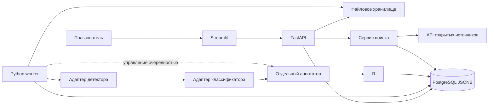

# План курсового проекта

**Тема:** Программное средство детекции и классификации объектов и аннотирования изображений с использованием искусственной нейронной сети.

**Дата подготовки:** 6 октября 2026 года. **Обновление статуса 08.10.2026:** по новой задаче пользователя подготовлен модуль сравнения четырёх детекторов, локальные веса в `detection/models/` и скрипты получения CSV/Markdown. Инструкция — [detection/README.md](detection/README.md), решения — [docs/decisions.md](docs/decisions.md). Полный восстановленный test-v2 (4500 изображений × три повтора каждого из четырёх детекторов) и 1000 парных bootstrap-выборок завершены; девять неизменённых проходов перенесены из test-v1, RF-DETR выполнен заново после исправления sparse COCO slots. Происхождение сохранено. Итоги — reports/comparisons/detection.csv, detection.md и detection_analysis.md. Приложение и два остальных сравнения ещё не реализованы; сокращённые dev-прогоны не используются для итоговых выводов.

Предлагается реализовать приложение на Python в Linux Docker-контейнерах: FastAPI принимает изображения, единственный worker выполняет нейросетевую обработку, PostgreSQL хранит результаты в JSONB, Streamlit предоставляет интерфейс. Сначала проводятся три самостоятельных сравнения по четыре готовые модели, затем выбранные модели объединяются в строго последовательный конвейер: **детектор → классификатор вырезанных объектов → отдельный аннотатор → согласование**. Обучение и дообучение не выполняются ни для одной модели.

Разработка ведётся в GitHub-репозитории [mishanikin055/kurs4](https://github.com/mishanikin055/kurs4). Этот URL уже установлен как `origin` текущего локального репозитория. Целевая среда — Linux, локальная разработка — в WSL2, запуск приложения и экспериментов — через Docker Compose. Оборудование: RTX 4050 Laptop 6 ГБ VRAM и 16 ГБ RAM. Переход в WSL описан в [WSL_SETUP.md](WSL_SETUP.md); сам перенос и установка в рамках подготовки плана не выполняются.

## 1. Основания и границы проекта

Единственный официальный источник требований — [задание на курсовую](Материалы%20для%20курсовой/Аникин_задание%20на%20курсовую.docx). Дополнения пользователя из переписки включены в настоящий план. Файл календарного графика не используется как источник задач или обязательных промежуточных сроков.

| Пункт задания | Что необходимо сделать | Проверяемый результат |
|---|---|---|
| 3.1 | Отдельно сравнить детекторы и классификаторы | Две таблицы по четыре модели, протоколы и собственные измерения |
| 3.2 | Сравнить модели аннотирования и методы формирования описаний | Третья таблица по четыре модели; проверка согласования текста и объектов |
| 3.3 | Разработать архитектуру | Схема компонентов, API, схема БД, контракты результатов |
| 3.4 | Реализовать детекцию, классификацию и аналитические аннотации | Работающий конвейер с сохранением промежуточных результатов |
| 3.5 | Реализовать поиск по открытым источникам и интерфейс | Формирование запросов из аннотаций, выдача ссылок, история обработки |
| 3.6 | Исследовать эффективность на разных графических данных | Эксперименты на эталонных и собственных изображениях, анализ ошибок |

Пользовательские требования: готовые веса, общая предметная область, Python для взаимодействия с моделями, JSON-результаты в БД, отдельная модель общей аннотации, сохранение картинки с рамками, скрипты загрузки, тестирования и формирования отчётов.

По заданию проект работы нужно представить **15.12.2026**, законченную работу — **22.12.2026**. Промежуточные даты в разделе 13 — предлагаемый рабочий график разработки, а не дополнительные требования руководителя.

### Что означает общая предметная область

Поддерживаются бытовые сцены, люди, животные, транспорт, мебель, предметы и смешанные композиции. При этом готовый детектор с COCO ограничен своим словарём из 80 категорий, а классификатор ImageNet — 1000 категориями. «Общая область» не означает распознавание любых существующих объектов. Аннотатор может описывать понятия вне этих словарей; такие упоминания обрабатываются отдельно.

Не входят в обязательный объём: обучение, сегментация, видео и трекинг, мобильное приложение, распределённый кластер, распознавание личности, определение точного места съёмки и поиск оригинала изображения в интернете.

## 2. Исследовательская постановка

Проверить следующие вопросы:

1. Как различаются готовые детекторы разных семейств по качеству, задержке и потреблению памяти на одном оборудовании?
2. Какие классификаторы эффективны на стандартных изображениях и насколько переносится результат на вырезанные детектором объекты?
3. Какая модель формирует наиболее точные, информативные и достаточно быстрые описания без обучения?
4. Снижает ли согласование описания с детекцией число неподтверждённых утверждений и какой ценой по полноте и времени?
5. Насколько сформированные аннотации пригодны для поиска информации в открытых источниках?

Сравниваются **готовые программные конфигурации**, а не изолированное влияние архитектуры: модели отличаются данными предобучения, размером, препроцессингом и обучающим рецептом. Вывод «трансформеры всегда лучше CNN» по этому эксперименту делать нельзя.

## 3. Выбор 12 моделей

### 3.1 Как обосновать популярность

Требование пользователя — четыре наиболее популярные модели в каждом сравнении. Универсального сопоставимого рейтинга для всех библиотек нет. Ниже дан **предварительный инженерный набор**, а не доказанный мировой топ-4. До загрузки полного комплекта необходимо зафиксировать критерий популярности и финальную четвёрку каждой задачи.

Порядок отбора:

1. Составить расширенный список минимум из восьми семейств для каждой задачи по официальным каталогам. Не считать четыре размера одной модели четырьмя архитектурами.
2. Проверить пригодность: опубликованные веса, локальный инференс, отсутствие обязательного обучения, нужные классы/выходы, допустимый ресурсный профиль.
3. Для каждой кандидатуры сохранить дату, URL, поддержку в библиотеках, число загрузок конкретного checkpoint на Hugging Face за одинаковый период, звёзды профильного репозитория и дату последнего релиза, если эти данные доступны.
4. Не подменять отсутствующие значения нулями. Не приписывать звёзды всего torchvision одному ResNet и не сравнивать их напрямую со звёздами отдельной модели. Счётчики Hugging Face отражают обращения к определённым файлам, а не уникальных пользователей [S14].
5. Для строгого рейтинга использовать одну сопоставимую метрику и одинаковый охват, например загрузки за месяц официальных checkpoint среди пригодных моделей Hub. Явно указать, что такой рейтинг не охватывает загрузки через все другие каналы.
6. Если архитектурное разнообразие требует взять модель вне такого топ-4, описать это как обоснованный подбор популярных представителей. Не выдавать этот вариант за буквальное выполнение требования о четырёх лидерах рейтинга; отразить согласованную формулировку в отчёте.
7. Сохранить выбор в `docs/model_selection.md` и `configs/models.yaml`, дату среза и снимок исходных данных — в `reports/model_selection/`. После начала финальных экспериментов набор не менять без новой версии протокола.

Так разделяются актуальность, распространённость и качество: новая модель не обязательно наиболее популярна, а популярная не обязательно победит по точности.

### 3.2 Сравнение 1 — детекция объектов

Предварительно предлагается следующая четвёрка с общим выходным пространством COCO.

| Модель и точный вариант | Семейство и смысл сравнения | Источник готовых весов / интерфейс |
|---|---|---|
| YOLO26s | Одностадийный детектор преимущественно на свёртках; современное быстрое семейство, также содержащее специализированные модули | Ultralytics, `yolo26s.pt` [S1] |
| RT-DETRv2 R18 | Гибрид: свёрточный backbone и transformer decoder; скорость и глобальное взаимодействие признаков | `PekingU/rtdetr_v2_r18vd` [S2] |
| RF-DETR Small | Детектор с transformer backbone DINOv2; современный представитель DETR-подхода | Официальный пакет `rfdetr`, класс `RFDETRSmall` [S3] |
| Faster R-CNN ResNet50 FPN V2 | Двухстадийная свёрточная архитектура; классическая контрольная точка | `FasterRCNN_ResNet50_FPN_V2_Weights.COCO_V1` [S4] |

YOLO26 представлен в действующей официальной документации; RF-DETR Small имеет опубликованный интерфейс и готовые веса. Faster R-CNN включён для сравнения двухстадийного подхода, а не как новинка 2026 года. Замену на более популярного кандидата при строгом отборе следует делать до фиксации экспериментов.

Для всех адаптеров проверить отображение внутренних меток в COCO category_id: 80 классов не означают, что все библиотеки используют непрерывные номера 0–79. Фон и пропуски в COCO ID не должны попадать в предсказания.

### 3.3 Сравнение 2 — классификация

В одном сравнении участвуют **четыре классификатора с готовой классификационной головой на 1000 классов ImageNet-1K: ResNet-50, EfficientNetV2-S, ConvNeXt-Tiny и ViT-B/16**. По решению пользователя zero-shot классификация исключена из текущего объёма: ни отдельного сравнения, ни смешанной таблицы с CLIP/SigLIP2 не планируется. Все веса используются без собственного обучения и дообучения.

| Модель | Архитектурный смысл | Точный набор весов / checkpoint |
|---|---|---|
| ResNet-50 | Классическая CNN с остаточными связями | `ResNet50_Weights.IMAGENET1K_V2` [S5] |
| EfficientNetV2-S | Эффективная CNN с иным устройством блоков и масштабированием | `EfficientNet_V2_S_Weights.IMAGENET1K_V1` [S6] |
| ConvNeXt-Tiny | Современная CNN, позволяющая сравнить развитие свёрточного подхода с transformer | `ConvNeXt_Tiny_Weights.IMAGENET1K_V1` [S7] |
| ViT-B/16 | Vision Transformer с self-attention над патчами | `ViT_B_16_Weights.IMAGENET1K_V1` [S8] |

Это предварительный набор распространённых архитектур, не утверждение об их четырёх первых местах в текущем рейтинге. Версию весов указывать явно; подвижный псевдоним `DEFAULT` в зафиксированных экспериментах не использовать.

**Общий benchmark:** одни и те же изображения и 1000 классов ImageNet-1K. Все четыре модели используют готовые головы. Фиксируются порядок классов, synset, названия и штатный препроцессинг каждого checkpoint. Это сравнение готовых CNN и Vision Transformer; различия обучающих рецептов авторов раскрываются, даже при одинаковом словаре классов.

**Прикладной benchmark:** одни и те же вырезанные области, эталонные метки и общий словарь оцениваемых категорий. Нужен проверенный mapping ImageNet → целевые классы; неподдерживаемые категории показываются отдельно. Всех четырёх сравнивать на одной поддерживаемой части словаря с указанием покрытия. Стандартная оценка ImageNet и оценка на crops — два режима одного сравнения классификаторов, а не разные наборы моделей.

### Роль классификатора в конвейере

Детектор уже присваивает объекту категорию. Отдельный классификатор имеет смысл как проверка и уточнение, например `dog → golden retriever` или `car → van`, если crop содержит достаточные признаки и нужные категории поддерживаются. Гарантировать улучшение нельзя: кадрирование, низкое разрешение, фон и перекрытия ухудшают качество. Необходимо сравнить `detector-only` с `detector + classifier`, учитывая не только удачные уточнения, но и ошибочные изменения.

Для уточнения использовать только категории и подтипы, присутствующие в готовом словаре ImageNet, и их проверенное соответствие классам детектора. Русские подписи для UI хранить отдельно от synset. Добавление названия нового объекта в конфиг не добавляет такой класс в классификационную голову. Описательный аннотатор не должен формировать правильные ответы для собственного benchmark.

В рабочем режиме получить top-k по всем 1000 классам независимо от детекторной метки, затем проверить совместимость по mapping. Исходная метка детектора и top-k классификатора сохраняются отдельно. При слабом результате или близких вариантах статус — `uncertain`; при несовместимом классе — `conflict`; исходное название не заменяется автоматически. Softmax закрытого классификатора может быть высоким даже для неизвестного объекта: отказ требует проверки порогов/разрыва оценок на dev и примерах вне словаря. Не обещать надёжное распознавание неизвестных объектов одним порогом.

Породы, точные модели автомобилей и другие уточнения оцениваются только при наличии соответствующей эталонной разметки. COCO размечает общие категории и не доказывает правильность тонкого уточнения. Классификатор не обнаруживает пропущенный детектором объект и не исправляет координаты рамки.

### 3.4 Сравнение 3 — общая текстовая аннотация

| Модель | Что представляет | Точный checkpoint |
|---|---|---|
| BLIP base | Специализированная модель image captioning; контрольная точка для коротких описаний | `Salesforce/blip-image-captioning-base` [S9] |
| Florence-2 base fine-tuned | Унифицированная визуально-языковая модель с заданиями, задаваемыми токенами | `microsoft/Florence-2-base-ft` [S10] |
| Qwen3-VL 2B Instruct | Инструктивная VLM для свободных описаний и последующей проверки фактов | `Qwen/Qwen3-VL-2B-Instruct` [S11] |
| SmolVLM2 500M Video Instruct | Компактная инструктивная VLM для ограниченных ресурсов; поддерживает и отдельные изображения | `HuggingFaceTB/SmolVLM2-500M-Video-Instruct` [S12] |

В этой группе различается способ построения визуально-языковой системы и подготовки к задачам. Не следует искусственно представлять её как сравнение чистых CNN с чистыми transformer: все четыре используют transformer-компоненты.

Суффикс `ft` у Florence означает готовые веса, дообученные авторами; собственного обучения в проекте нет. Для аннотирования передавать исходное изображение без нарисованных рамок, чтобы подписи и цветные линии не влияли на описание.

Для автоматического сравнения использовать английские описания и английские эталонные подписи. Русскоязычное описание — отдельный прикладной сценарий: проверить прямую генерацию там, где она поддерживается; для остальных моделей оценить единый локальный перевод как дополнительный этап. Не смешивать переведённые и исходные тексты в одном рейтинге и не считать переводчик тринадцатым участником основного сравнения. Выбор переводчика — отдельное решение при реализации.

### 3.5 Оборудование и загрузка

Целевой компьютер — текущий ноутбук пользователя. Через `nvidia-smi` 06.10.2026 подтверждены **NVIDIA GeForce RTX 4050 Laptop GPU, 6141 MiB VRAM, драйвер 610.78**. Процессор со слов пользователя — Intel Core i5-12400K, **оперативная память — 16 ГБ**. Точные сведения об ОС, CPU и доступной памяти процесса записать при проверке Linux-окружения. Через `wsl --list --verbose` подтверждён дистрибутив **Ubuntu-26.04, WSL2**; на момент проверки он остановлен.

План рассчитан на **6 ГБ VRAM**, batch size 1 и последовательную работу моделей. Для аннотирования выбран SmolVLM2 500M вместо более тяжёлого варианта 2.2B. Наличие `Video` в названии не требует реализации видео: модель принимает одиночные изображения [S12]. Qwen3-VL 2B остаётся более требовательным кандидатом: хранение примерно 2 млрд параметров по 2 байта уже занимает около 4 ГБ без активаций и кэша генерации. Полное размещение в 6 ГБ заранее не гарантируется.

Первый технический этап — измерить доступные VRAM и RAM при работающих WSL, Docker, API и БД, затем проверить каждый аннотатор на одном изображении. Начать с 16-битного режима, ограниченного числа визуальных токенов, короткого prompt и бюджета 96 выходных токенов, если конкретная модель это поддерживает. **В памяти одновременно только одна нейросетевая модель**, без загрузки следующей в фоне. Датасеты читать потоково с диска. Не держать все crops и декодированные изображения в RAM; data loader первоначально без дополнительных процессов.

Для 16 ГБ физической RAM ориентир планирования — около 10 ГБ под WSL/Docker с резервом для Windows и приложений. Это не готовая настройка: проверить фактический лимит WSL и расход, не назначать каждому контейнеру отдельно по 10 ГБ. CPU offload VLM также расходует RAM и не считается бесплатным выходом из OOM. Сначала использовать обычный PyTorch eager/SDPA внутри Linux-контейнера; FlashAttention не обязателен.

Если Qwen не помещается, явно зафиксировать CPU offload либо отдельный квантованный профиль и измерить его качество и время. В таблице показать различия режима; такой результат нельзя называть сравнением скорости в одинаковой точности и размещении. Если практический режим не проходит ресурсный отбор, заменить кандидата **до** фиксации финальной четвёрки и записать причину. Уже зафиксированных участников не менять молча.

Все веса должны находиться внутри `models/`. Скачать также tokenizer, processor, конфигурации, словари меток и необходимые файлы реализации. Перенаправить кэши Hugging Face и PyTorch внутрь проекта. Не скачивать все дублирующие форматы одного checkpoint.

Перед загрузкой получить реальный перечень файлов и размеры; затем проверить свободное место с запасом для временных файлов и датасетов. Для 12 моделей и данных закладывать десятки гигабайт, точную величину считать по выбранным версиям. В файле `models/manifest.json` хранить модель, revision/commit, источник, локальные пути, размер каждого файла, SHA-256, лицензию, время загрузки и результат офлайн-проверки. Для GitHub-релизов и torchvision фиксировать URL артефакта и хеш, для Hub — commit revision.

Статусы загрузки: `planned`, `downloading`, `downloaded`, `verified`, `smoke_passed`, `failed`. Наличие имени модели в конфиге не является подтверждением скачивания. Загрузка должна возобновляться, проверяться и завершаться атомарно. Проверить старт с запрещённым доступом в интернет.

## 4. Данные и экспериментальные выборки

### Почему это не обучение

Все модели уже обучены авторами; проект только запускает их и сверяет ответы с эталоном. `dev` означает небольшой набор для проверки программы, выбора порога отказа и фиксирования prompts; `evaluation` — изображения для окончательных измерений после фиксации настроек. Ни в одном режиме веса не обновляются.

Ранее предложенные **5000 dev / 45 000 test отменены как обязательное разделение**. Это было внутреннее предложение по разбиению официальной validation-части ImageNet, а не требование датасета и не обучение на 5000 картинках. Ниже дан более простой протокол. Не называть внутреннюю evaluation-подвыборку официальным закрытым test ImageNet.

### Детекция

- Основной источник — COCO val2017, 5000 изображений и эталонные bounding boxes [S13].
- Из него до измерений зафиксировать непересекающиеся dev- и test-манифесты: 500 изображений для настройки порогов, 4500 для основных выводов. Проверить распределение классов, размеров объектов и числа объектов на сцене.
- Для сопоставления с опубликованными цифрами можно дополнительно оценить все 5000 с настройками авторов; назвать это стандартной validation-оценкой, а не независимым test после подбора параметров.
- Быстрый smoke-набор из 20–50 изображений не использовать для итоговых выводов.

### Классификация

- Основной источник — официальная validation-часть ImageNet-1K, 50 000 изображений [S15]. Получение данных и доступ к ним проверяются до загрузки; условия источника соблюдаются.
- Для первого сравнения заранее выбрать **5000 evaluation-изображений — по 5 на каждый из 1000 классов**, с фиксированным seed и manifest. Настройки и препроцессинг моделей берутся штатные, порядок меток проверяется до оценки. При приемлемом времени провести финальное сравнение на всех 50 000 и отразить полный размер в отдельном запуске.
- При сравнении штатных Top-1/Top-5 отдельный dev из этих 50 000 не обязателен. Если всё же настраивать пороги или другие параметры на части ImageNet validation, выделить и сохранить отдельные dev image_id и исключить их из итоговой независимой оценки. Не подбирать варианты по уже просмотренному результату evaluation.
- Если эталонная разметка или доступ отсутствуют, подготовить адаптер для предоставленного локального датасета. Не подменять тест случайной папкой изображений без меток и не называть её ImageNet.
- Отдельно оценить классификацию GT-crops и detector-crops. Создать проверенную таблицу соответствия ImageNet synset → COCO category там, где соответствие однозначно; неподдерживаемые классы учитывать как `not_mappable` и показывать покрытие. Порог отказа для прикладных crops настраивать на COCO dev, а не на итоговом crop-наборе; ImageNet-порог нельзя автоматически переносить на crops.
- Для GT-crops считать условную точность по поддерживаемым категориям; для detector-crops сопоставлять рамки с эталоном по IoU и считать также сквозную ошибку. Ошибку локализации не выдавать за чистую ошибку классификатора.

### Аннотирование

- Использовать изображения COCO с официальными captions; применять тот же image_id, что и для детекции, без угадывания соответствий по порядку файлов.
- Для разработки — 100 изображений из dev; основное сравнение — фиксированные 500–1000 изображений из test. При достаточных ресурсах расширить все четыре модели на одинаковую выборку.
- Проверить известные пересечения тестовых изображений с данными обучения готовых captioning-моделей; для моделей с неизвестными обучающими наборами пометить риск пересечения. Не заявлять независимую оценку обобщения без таких сведений.
- Дополнить 100–200 собственными или разрешёнными к использованию изображениями разных сцен. Зафиксировать происхождение, разрешение на использование, эталонные объекты и описания. Этот набор особенно важен для проверки вне публичных бенчмарков.

### Сложные условия

Из отдельной фиксированной подвыборки получить версии с пониженным разрешением, JPEG-сжатием, размытием и затемнением; параметры преобразований сохранить. Дополнительно выделить реальные сцены с мелкими объектами, перекрытиями и большим числом объектов. Искусственные и естественные условия анализировать отдельно. Варианты одного исходного изображения не должны попадать в разные dev/test-части.

## 5. Критерии и протокол сравнения

| Задача | Основные критерии качества | Дополнительные критерии |
|---|---|---|
| Детекция | COCO mAP@[0.50:0.95], AP50, AP75 | AP малых/средних/крупных объектов, AR, precision/recall/F1 при фиксированном пороге, ошибки по классам |
| Классификация | Top-1, Top-5 на одинаковом словаре | Macro-F1, accuracy по классам, матрица ошибок; на crops — покрытие, доля отказов, точность принятых уточнений и ошибочных изменений |
| Аннотация | CIDEr, экспертная фактическая корректность | BLEU-4, ROUGE-L, CHAIR, полнота, информативность, длина; SPICE при доступном проверенном evaluator |
| Все модели | p50 и p95 задержки, throughput, пиковая VRAM/RAM | Время холодной загрузки, размер весов, число параметров, ошибки/OOM, офлайн-работа |
| Полный конвейер | Время от задания до результата, доля успешных обработок | Задержка по этапам, воспроизводимость, согласованность, размер сохраняемых данных |

CHAIR оценивает галлюцинации объектов относительно эталонной разметки и словаря, а не предсказаний нашего детектора [S16]. Использовать официальную или проверенную реализацию со всеми требуемыми аннотациями и правилами лексического сопоставления. Ограниченность словаря и разметки указать в отчёте. Нельзя назвать долю расхождений с детектором стандартной CHAIR.

### Единые условия измерения

1. Зафиксировать железо, ОС, Python, драйвер, CUDA, версии зависимостей, revision весов, список изображений, seed и конфиг. Для каждого запуска присвоить `experiment_id`.
2. Использовать `eval()` и `inference_mode()`; не запускать обучение, оптимизатор или вычисление градиентов.
3. Основной режим интерактивного приложения — batch size 1. Пакетную производительность измерять отдельно при одинаковом batch size и явно указывать OOM.
4. CPU/FP32 и GPU-режимы вести раздельно. Внутри сравнения применять общую поддерживаемую точность; если она невозможна, явно разделить конфигурации. Квантование, offload, ONNX и TensorRT — отдельные эксперименты, не скрытая оптимизация одного участника.
5. Использовать штатный препроцессинг выбранного checkpoint. Сохранить размер входа, resize/crop/letterbox и нормализацию. Насильственно приводить все модели к 224×224 или 640×640 нельзя: это меняет штатное качество.
6. Отдельно измерять загрузку модели; затем выполнить 20 прогревочных проходов и три измерительных повторения. Для VLM предварительно проверить стоимость, при необходимости уменьшить прогрев одинаково для всех и записать решение до финального запуска.
7. На CUDA синхронизировать устройство перед началом и окончанием измерения. Не включать скачивание в инференс. Разделять `preprocess`, `forward/generate`, `postprocess` и полное время этапа; для приложения отдельно учитывать чтение файла, очередь и запись БД.
8. Задержку VLM считать для всей генерации описания; дополнительно сохранить число выходных токенов и tokens/s. Одинаковый верхний предел токенов не гарантирует одинаковую длину текста.
9. Для captions зафиксировать семантически одинаковую задачу: кратко описать основные видимые объекты, действия и обстановку без догадок. BLIP и Florence требуют своих штатных интерфейсов и task tokens; сохранить точные prompts. Пример общего бюджета — 96 новых токенов, без sampling, одинаковые правила остановки там, где они поддерживаются.
10. Для AP сохранять предсказания с достаточно низким порогом score и нужным max_detections; UI-порог не применять перед расчётом AP. NMS использовать только там, где он нужен архитектуре. Порог для демонстрации и precision/recall выбрать на dev и заморозить.
11. Модели запускать по одной, исключить конкуренцию за GPU. Менять порядок запусков между повторами, сохранять индивидуальные измерения; OOM и сбои показывать явно, не удалять неудобные изображения из выборки молча.
12. Для качества оценить 95% интервалы парным bootstrap по image_id, например 1000 повторов. Для AP пересчитывать dataset-level AP на bootstrap-выборках, не усреднять несуществующую «AP отдельной картинки». Коррелированные искажённые версии группировать по исходному изображению.

### Экспертная оценка описаний

Подготовить слепую перемешанную выборку из 100 изображений; один и тот же состав для четырёх моделей. Желательно два независимых оценщика. По каждому тексту оценить по шкале 1–5: фактическую корректность, полноту значимых деталей, связность и полезность для поиска; отдельно отметить выдуманные объекты, действия и свойства. При одном оценщике указать это как ограничение. Результаты автоматического LLM-судьи, если он появится, не подменяют такую проверку.

### Выбор победителей

Сначала исключить конфигурации, которые не проходят ресурсные ограничения и обязательные проверки. Затем построить графики качество–задержка и качество–память и определить Парето-оптимальные варианты. Выбрать рабочий компромисс и запасной режим с меньшими требованиями. Не складывать mAP, CIDEr и миллисекунды в произвольный общий балл. Если нужен взвешенный рейтинг внутри задачи, веса и нормализацию объявить до получения результатов и проверить чувствительность выбора.

## 6. Согласование детекции, классификации и аннотации

Предлагается сохранять независимые результаты моделей и производную аналитическую аннотацию с происхождением каждого утверждения.

1. Детектор возвращает `object_id`, category_id, исходную метку, score и рамку в пикселях исходного изображения после корректировки EXIF.
2. После сохранения детекций и завершения процесса детектора по рамкам вырезаются области. Загружается классификатор и последовательно возвращает top-k, свой словарь и связь с object_id. Сопоставление словарей выполняется по явной версионируемой таблице; сохраняются совместимость меток и решение об отказе от уточнения.
3. После сохранения классификации и завершения её процесса загружается отдельная captioning-модель. Она получает исходное изображение и создаёт `raw_caption`. В базовом сравнении ей не передаются ответы других моделей. Параллельный запуск аннотатора и детектора запрещён.
4. Модуль согласования нормализует названия, синонимы и допустимые отношения обобщения. Из caption извлекаются проверяемые упоминания объектов. MVP использует версионируемый словарь и правила; их ограниченность учитывается при ручной оценке. Более сложный парсер — отдельное улучшение.
5. Утверждения получают статусы: `supported_by_detection`, `caption_only`, `detector_only`, `conflict`, `not_checkable`. Поддержка детектором означает согласие моделей, а не доказанную истину.
6. Упоминание объекта, которого детектор не нашёл, не удаляется автоматически: возможны пропуск детектора и категория вне COCO. Для количества, действий и свойств применять отдельные проверки; score детектора не является уверенностью текстового утверждения.
7. Итоговая аннотация содержит текст, список объектов, пространственные отношения, расхождения и происхождение данных. Координатные отношения вроде «левее» можно вычислить по рамкам; семантические выводы «держит», «управляет» из одной близости рамок не делать.
8. При поддержке инструкций можно повторно запросить выбранную VLM, передав исходное изображение, детекции и найденные расхождения. Сохранить и исходный, и уточнённый текст; число повторов ограничить одним. Если генерация не прошла проверку, вернуть исходный текст с флагами.

MVP согласования работает без дополнительной обучаемой модели: `raw_caption` плюс структурированная сводка и предупреждения. Повторная генерация — проверяемое улучшение, а не обязательное требование ко всем четырём captioning-моделям.

### Эксперимент по согласованию

На выбранных детекторе и аннотаторе сравнить три режима на одной отложенной выборке: A — независимое описание; B — описание и проверка правилами; C — проверка и одна повторная генерация, если модель это поддерживает. Сравнить CHAIR по GT, ручную фактическую точность, полноту, частоту расхождений и общую задержку. Не запускать все 64 сочетания 4×4×4 без исследовательской необходимости: три основных сравнения проводят независимо, а интеграцию — с выбранными конфигурациями.

## 7. Архитектура программного средства

### Рекомендуемый вариант

**Модульный backend на Python в Docker Compose с одним worker.** Streamlit взаимодействует с FastAPI через HTTP; FastAPI хранит задания и результаты в PostgreSQL; worker последовательно выполняет тяжёлые этапы. Все сервисы работают в Linux-контейнерах на одном компьютере. Windows используется как хост для WSL2 и Docker Desktop, а не как целевой runtime приложения.



Почему такой вариант:

- FastAPI даёт отделённый Python API, проверку схем и документируемые контракты.
- Streamlit позволяет быстро сделать интерфейс на Python; его перезапуски страницы не должны загружать модели или повторять задания [S19].
- PostgreSQL сочетает связи, транзакции и JSONB с индексированием [S18]. MongoDB допустима, но для связанных изображений, запусков и экспериментов отдельная документная БД не обязательна.
- Тяжёлый инференс не выполнять в event loop API и не полагаться на `BackgroundTasks` как на надёжную очередь длительных вычислений [S17].
- Для одного worker достаточно таблицы заданий в PostgreSQL. Redis/Celery оставить расширением; в данном проекте один исполнитель и строго последовательная обработка.
- SQLite допустима только для облегчённого прототипа и отдельных unit-тестов. Финальные проверки JSONB и транзакций проводить на PostgreSQL, не обещать полную эквивалентность двух БД.

### Очередь и ресурсы

Состояния задания: `queued → running → succeeded | partial | failed | cancelled`. Резервирование задания worker выполняет короткой атомарной транзакцией; длительный инференс не удерживает блокировки. Для возможного расширения предусмотреть `FOR UPDATE SKIP LOCKED`, `worker_id`, `lease_until`, heartbeat, число попыток и idempotency key. После падения процесса истёкшая аренда позволяет повторить задание без дублирования завершённых этапов.

Для каждого изображения порядок фиксирован: **детекция и overlay → завершение процесса детектора → классификация всех crops → завершение процесса классификатора → аннотация → завершение процесса аннотатора → согласование**. При нуле детекций классификация получает статус `skipped`, затем аннотатор обрабатывает исходное изображение. API-процессы весов не держат. Ошибка аннотатора не уничтожает уже сохранённые детекции и картинку с рамками.

Worker-координатор не загружает torch-модели сам: он последовательно создаёт дочерний процесс на этап и ждёт его завершения. Это освобождает память процесса и CUDA-контекст надёжнее одного `empty_cache()`, который не освобождает живые tensors. Результаты передаются через JSON/файлы и записываются в БД. Модель классификатора загружается один раз на этап для всех crops, а не заново на каждый объект. Цена решения — повторная загрузка весов, которую обязательно учитывать в сквозной задержке приложения.

Один общий межпроцессный lock ресурса инференса защищает приложение и benchmark от одновременного запуска моделей. Для одного Linux-хоста использовать `flock` на `storage/.locks/inference.lock` в одном и том же общем bind mount обоих контейнеров; создание lock-файла само по себе блокировкой не является. Открытый lock-дескриптор сохранять и в дочернем процессе, чтобы авария координатора не позволила запустить следующую модель при живом старом процессе. Lock должен удерживаться до остановки дочернего процесса; потеря DB lease не разрешает второму процессу начать инференс, пока первый ещё жив. При завершении/таймауте worker останавливает всю группу дочерних процессов и только затем освобождает lock. Блокировка контейнером GPU-устройства в Compose сама по себе не обеспечивает эксклюзивность.

В сравнительных скриптах одна модель может обрабатывать весь свой dataset подряд: загрузка → прогрев → измерения → завершение процесса → следующая модель. Порядок этапов приложения при этом не меняется. Многозадачный GPU-инференс и одновременная загрузка моделей в RAM запрещены.

### Контейнеры и взаимодействие

| Сервис Compose | Что делает | Доступ к моделям и данным |
|---|---|---|
| `db` | PostgreSQL: jobs, JSONB, история и версии | Постоянный named volume `pgdata`; без GPU |
| `api` | FastAPI: загрузка, постановка задания, результаты, сетевой поиск | `DATABASE_URL` указывает на `db`; storage read/write; без весов и GPU |
| `worker` | Один координатор и один активный дочерний процесс инференса | Единственный постоянно запущенный сервис с GPU; `models` read-only, storage read/write |
| `ui` | Streamlit | Обращается к `http://api:8000`, без прямого доступа к БД и моделям |
| `migrate` | Одноразовое применение миграций до старта приложения | БД; без GPU |
| `benchmark` | Одноразовые Python-сравнения, профиль `tools` | Тот же ML-образ, GPU, models/data read-only, reports read/write; только при остановленном worker |

В браузере пользователь открывает `http://localhost:8501`. Streamlit-сервер общается с API по внутреннему DNS-имени `api`; API и worker используют `db:5432`. API возвращает job_id сразу, UI опрашивает статус. Worker получает очередь из PostgreSQL, сохраняет JSON каждого этапа и файлы overlay. Веб-браузер не должен получать внутренний адрес `http://api:8000`: изображения выдаются через UI/API с доступным пользователю маршрутом.

Через volumes подключаются `./models:/app/models:ro`, `./data:/app/data:ro`, `./storage:/app/storage`, `./reports:/app/reports`. API получает только необходимые mounts. Веса и датасеты не копируются в образ при сборке. Загрузка весов — отдельная команда `tools` с write-доступом к models, затем runtime использует read-only. База и артефакты переживают пересоздание контейнеров; `down -v` не входит в обычный сценарий остановки.

Для worker и benchmark зарезервировать одну NVIDIA GPU через Compose device reservation с `capabilities: [gpu]` [S25]. Для Docker Desktop нужен WSL2 backend и поддерживаемый NVIDIA-драйвер [S24]. Не устанавливать Linux display driver внутрь контейнера; CUDA-библиотеки образа и torch подобрать совместно и закрепить тег/digest. Хостовая Ubuntu и Ubuntu внутри CUDA-образа могут иметь разные версии.

Сборка: лёгкий CPU-образ для API/UI/migrate и отдельный ML-образ для worker/benchmark. При несовместимости модельных библиотек допустимы закреплённые Python-окружения внутри ML-образа; координатор запускает нужный интерпретатор. Не поднимать три постоянно работающих сервера моделей и не выдавать worker доступ к Docker socket ради переключения этапов.

Старт БД проверяется healthcheck; `migrate` должен успешно завершиться до API/worker. Для API и worker предусмотреть повтор подключения при временной недоступности БД. Секреты — в локальном `.env`, пример имён — в `.env.example`. UI/API порты публикуются на localhost; PostgreSQL по умолчанию остаётся внутри сети Compose.

Команды ниже — **контракт будущей реализации**, сейчас compose-файла ещё нет:

```bash
docker compose up --build -d
docker compose logs -f worker
docker compose stop worker
docker compose --profile tools run --rm benchmark python scripts/benchmark_detection.py --config configs/benchmark_detection.yaml --output-dir reports/runs/detection-001
docker compose --profile tools run --rm benchmark python scripts/benchmark_classification.py --config configs/benchmark_classification.yaml --output-dir reports/runs/classification-001
docker compose --profile tools run --rm benchmark python scripts/benchmark_captioning.py --config configs/benchmark_captioning.yaml --output-dir reports/runs/captioning-001
docker compose --profile tools run --rm benchmark python scripts/build_report.py --runs-dir reports/runs --output-dir reports/comparisons
docker compose start worker
```

Все команды comparisons выполняются последовательно. Дополнительно реализовать shell-обёртку, которая останавливает worker, проверяет lock, запускает выбранный benchmark и восстанавливает worker после завершения. Сам lock обязателен и для ручного запуска, чтобы второй benchmark не прошёл параллельно.

### Модули

| Модуль | Ответственность |
|---|---|
| `api` | HTTP, валидация входа, идентификаторы заданий, выдача результатов |
| `domain` | Общие схемы и статусы, не зависящие от модельных библиотек |
| `models` | Реестр, загрузка, адаптеры детекции/классификации/аннотирования |
| `pipeline` | Последовательность этапов, частичные результаты, отмена и повторы |
| `reconciliation` | Словари, сопоставление классов, проверка утверждений |
| `storage` | PostgreSQL, миграции, файловые артефакты |
| `search` | Запросы по аннотациям, провайдеры, кэш, результаты |
| `benchmark` | Датасеты, измерения, метрики, сводки экспериментов |
| `ui` | Загрузка изображения, просмотр результатов, сравнение, история |

## 8. Хранение и контракты

Изображения хранить файлами, результаты — объектами JSONB. Не помещать base64 изображений в JSON результата. Для воспроизводимости хранить исходные байты, нормализованную версию для анализа и изображение с рамками; указывать, к какой версии относятся координаты.

| Таблица | Основные поля |
|---|---|
| `images` | UUID, исходное имя, SHA-256, MIME, размеры, относительные пути, время загрузки |
| `model_versions` | alias, task, source, revision, manifest/hash, параметры препроцессинга JSONB |
| `jobs` | image_id, status, config JSONB, idempotency_key, lease, attempts, timestamps, error |
| `stage_results` | job_id, stage, model_version_id, schema_version, payload JSONB, timings JSONB, status |
| `artifacts` | job_id, kind, relative_path, MIME, SHA-256, размер |
| `annotation_revisions` | job_id, revision, parent_revision, source `model/user`, payload JSONB |
| `search_runs` | annotation_revision_id, query, provider, params JSONB, results JSONB, fetched_at, error |
| `experiments` | protocol_version, dataset_manifest_hash, environment JSONB, config JSONB, summary JSONB, artifact paths |

Метаданные и связи выносить в обычные столбцы, вложенные ответы моделей — в JSONB. Использовать внешние ключи и уникальность результата `(job_id, stage, attempt)`; историю запусков не перезаписывать. Сначала необходимые B-tree индексы по идентификаторам, статусу и датам; GIN по JSONB добавлять для конкретных запросов, не для каждого поля автоматически.

Пример структуры ответа ниже **иллюстративный**, значения не получены экспериментом:

```json
{
  "schema_version": "1.0",
  "job_id": "example-job",
  "image": {"id": "example-image", "width": 1280, "height": 720},
  "status": "succeeded",
  "detection": {
    "model_alias": "detector-selected",
    "model_version_id": "example-version",
    "coordinate_space": "normalized_image_pixels",
    "box_format": "xyxy",
    "objects": [{
      "object_id": "obj-1",
      "category_id": 18,
      "label": "dog",
      "score": 0.91,
      "bbox": [80, 140, 510, 650]
    }],
    "visualization_artifact_id": "example-overlay"
  },
  "classification": {
    "model_alias": "classifier-selected",
    "label_space": "imagenet1k",
    "objects": [{
      "object_id": "obj-1",
      "top_k": [{"synset": "n02099601", "label": "golden retriever", "score": 0.67}],
      "mapped_detection_label": "dog",
      "agreement": "compatible"
    }]
  },
  "annotation": {
    "model_alias": "captioner-selected",
    "language": "en",
    "raw_caption": "A dog is standing outdoors.",
    "reconciled_caption": null,
    "claims": [{
      "text": "dog",
      "status": "supported_by_detection",
      "object_ids": ["obj-1"]
    }],
    "warnings": []
  },
  "provenance": {"experiment_id": null, "config_hash": "example-hash"}
}
```

В реальных схемах использовать UUID, timezone-aware UTC timestamps, проверки диапазонов score, границ рамок и валидных перечислений. Числа NaN/Infinity преобразовывать в явную ошибку/отсутствие значения, не сериализовать в JSON. Вероятности разных моделей не усреднять без обоснованного метода калибровки. Исправления пользователя хранить новой ревизией.

Файл артефакта сначала записывать во временный путь, затем атомарно переименовывать и регистрировать в БД. Предусмотреть очистку осиротевших временных файлов и ошибку недоступного артефакта; транзакция БД сама по себе не делает файловую запись атомарной.

## 9. API и пользовательский интерфейс

| Метод и маршрут | Назначение |
|---|---|
| `POST /api/v1/images` | Загрузить и проверить JPEG/PNG/WebP, вернуть image_id |
| `POST /api/v1/jobs` | Выбрать изображение и доступные модели, поставить обработку, вернуть 202 + job_id |
| `GET /api/v1/jobs/{id}` | Статус, текущий этап, ошибки, прогресс |
| `GET /api/v1/jobs/{id}/results` | Версионированный JSON всех этапов |
| `POST /api/v1/jobs/{id}/cancel` | Запросить отмену с безопасной остановкой между этапами |
| `GET /api/v1/artifacts/{id}` | Получить оригинал или изображение с рамками |
| `GET /api/v1/models` | Модели, локальная доступность, ограничения, статус проверки |
| `GET /api/v1/images` | История с пагинацией и фильтрами |
| `POST /api/v1/jobs/{id}/annotations` | Сохранить ручную редакцию отдельной ревизией |
| `POST /api/v1/annotations/{id}/searches` | Выполнить поиск по выбранной ревизии и отредактированному запросу |
| `GET /api/v1/searches/{id}` | Получить источники и диагностические сведения |
| `GET /api/v1/experiments` | Просмотреть результаты сравнений |
| `GET /health/live`, `GET /health/ready` | Жив ли API, доступна ли БД и необходимые компоненты |

Основной экран: загрузка → выбор набора моделей → обработка → исходник и рамки рядом → таблица объектов и top-k → общая аннотация и расхождения → поиск по открытым источникам. Дополнительные экраны: история, сравнение моделей, экспорт JSON/CSV и изображения с рамками. Повторное обновление страницы не создаёт новый запуск; UI хранит job_id и опрашивает его статус.

При загрузке проверить фактический формат и декодирование, ограничить байты и число пикселей, обработать EXIF-поворот, RGB/alpha и повреждённые файлы. Имена пользователя не превращать в серверные пути. Пути и артефакты выдавать по ID из разрешённого хранилища.

## 10. Поиск по открытым источникам

Этот модуль обязателен по п. 3.5 задания. Предлагаемый MVP — текстовый поиск справочной информации в Wikipedia через MediaWiki API [S20], при необходимости с переходом к Wikidata. Это конкретные открытые источники, а не полный поиск по всему интернету. Если руководителю нужен общий веб-поиск, добавить отдельного провайдера после определения доступного API и его условий.

Запрос строится из поддержанных названий объектов, уточнений классификатора и безопасных деталей описания. Пользователь видит и может исправить его перед запуском. Само изображение внешнему источнику не передаётся. Результат хранит заголовок, URL, выдержку, источник, позицию, запрос и время обращения. Выдержки очищаются от HTML; сетевой сбой не отменяет обработку изображения.

Контракт `SearchProvider.search(query, language, limit)` отделить от API приложения. Предусмотреть timeout, ограниченные повторы при временной ошибке, лимит частоты, кэш и отключённый сетевой режим. Найденный текст не является подтверждением того, что объект или событие действительно присутствуют на изображении.

Для проверки сформировать минимум 50 изображений/запросов, сравнить запрос из меток и запрос из согласованной аннотации. Оценить Precision@5 и MRR по заранее определённым ручным оценкам релевантности, успешность запросов и задержку. Выдача меняется со временем, поэтому сохранять её снимок и дату.

## 11. Скрипты, которые требуется реализовать

**Это спецификация будущих команд. На текущем этапе этих скриптов ещё нет.** Командные имена фиксируются как ориентир для реализации; после появления кода README должен содержать проверенные команды.

| Скрипт | Параметры и действия | Результат |
|---|---|---|
| `scripts/check_environment.py` | ОС, Python, GPU/CPU, RAM/VRAM, диск, совместимость пакетов | `reports/environment.json` |
| `scripts/collect_model_candidates.py` | Источники, задачи, дата, период популярности | Снимок кандидатов для обоснования выбора |
| `scripts/download_models.py` | `--task`, `--model`, `--all`, `--dry-run`, `--verify`, `--resume` | Веса и комплект конфигураций в `models/`, manifest |
| `scripts/prepare_datasets.py` | Локальные пути/источники, разметка, seed, размеры split | Воспроизводимые manifests и отчёт проверки меток |
| `scripts/smoke_models.py` | По одному изображению на модель, `--offline` | Проверка загрузки, схемы и артефактов всех 12 моделей |
| `scripts/benchmark_detection.py` | Config, dataset manifest, device, precision, output | COCO predictions JSON, timings JSONL, metrics JSON |
| `scripts/benchmark_classification.py` | Config, dataset manifest, image/crop mode, ImageNet label mapping | Top-k, метрики, confusion matrix, coverage/rejection, timings |
| `scripts/benchmark_captioning.py` | Config, prompts, dataset manifest, generation limit | Captions JSONL, метрики текста и галлюцинаций, timings |
| `scripts/benchmark_pipeline.py` | Набор моделей, режим согласования A/B/C | Метрики конвейера и расхождений |
| `scripts/evaluate_search.py` | Queries, сохранённая выдача, judgments | P@5, MRR, latency, ошибки провайдера |
| `scripts/build_report.py` | `--runs-dir`, `--output-dir`, каталог завершённых запусков | Три сравнительные таблицы CSV/Markdown, графики PNG/SVG, Markdown-отчёт |

Каждый runner должен поддерживать `--config`, `--output-dir`, `--limit` для smoke, `--seed`, `--resume`, журнал ошибок и ненулевой exit code при неуспехе. `--limit` явно помечает результат как сокращённый. Продолжение разрешено только при совпадении модели, hash конфигурации и manifest данных. Метрики качества пересчитывать по всему завершённому набору предсказаний, не усреднять показатели отдельных частей.

Структура одного экспериментального запуска:

```text
reports/runs/<experiment_id>/
  config.json
  environment.json
  model_manifest.json
  dataset_manifest.json
  predictions.jsonl
  timings.jsonl
  metrics.json
  errors.jsonl
  summary.md
  figures/
```

Итоговые графики: mAP–latency, Top-1–latency, CIDEr–latency, фактическая корректность–полнота, VRAM по моделям, распределение задержек, падение качества при искажениях. В каждой таблице ровно четыре выбранных участника, ссылки на run_id и размер выборки. Не заполнять таблицы выдуманными результатами; опубликованные показатели, если нужны, вынести в отдельную таблицу с условиями авторов.

### Обязательный комплект результатов сравнения

Для каждого из трёх сравнений передаются **и таблица, и запускавший её Python-код**, а не только снимок экрана или notebook. Конкретные выходы: `reports/comparisons/detection.csv`, `classification.csv`, `captioning.csv` и одноимённые `.md`. Дополнительные crop- и pipeline-таблицы относятся к тем же задачам и не создают четвёртое основное сравнение.

В комплект входят исходные `scripts/benchmark_*.py`, общий пакет метрик, точные конфиги, dataset/model manifests, lock-файл зависимостей, Dockerfile/Compose, команды запуска и сырые predictions/timings. Каждая строка таблицы связана с run_id, hash весов, Git commit и digest контейнера. При незакоммиченных изменениях записывать dirty-status и снимок использованного кода; не приписывать результаты другому commit. Повторный `build_report.py` должен строить таблицы из результатов без повторного инференса.

## 12. Планируемая структура репозитория

```text
AGENTS.md
PROJECT_PLAN.md
README.md
WSL_SETUP.md
pyproject.toml
compose.yaml
docker/
  Dockerfile.app
  Dockerfile.ml
.env.example
.dockerignore
.github/workflows/ci.yml
configs/
  models.yaml
  benchmark_detection.yaml
  benchmark_classification.yaml
  benchmark_captioning.yaml
  pipeline.yaml
src/vision_coursework/
  api/
  domain/
  models/{detection,classification,captioning}/
  pipeline/
  reconciliation/
  storage/
  search/
  benchmark/
  worker.py
ui/
scripts/
tests/{unit,integration,smoke}/
migrations/
docs/{model_selection,architecture,experiment_protocol,decisions}.md
models/manifest.json
data/{raw,manifests,processed}/
storage/{originals,normalized,overlays}/
reports/{runs,comparisons}/
```

Исходные DOCX и существующие `_theses_template/`, `_theses_work/` сохраняются отдельно. Тяжёлые веса, датасеты, кэши, окружения и секреты исключаются из Git; конфиги, manifests, маленькие тестовые примеры и итоговые отчёты версионируются. Не добавлять в репозиторий временные файлы Word `~$*`.

### GitHub и Linux-разработка

Рабочий репозиторий — `https://github.com/mishanikin055/kurs4.git`, новая площадка не создаётся. После перехода основной checkout размещается в `~/projects/kurs4` внутри Linux-файловой системы WSL; параллельно разрабатывать две независимые копии на Desktop и в WSL не следует. Хранение проекта в Linux home предпочтительно для Linux-инструментов и файлового ввода-вывода [S26].

Разработка ведётся в ветках `codex/<task>`, небольшими проверяемыми изменениями; текущая локальная ветка при проверке — `master`, remote default branch уточняется перед первой веткой реализации. В GitHub должны попадать код, документация, конфиги, Docker-файлы и небольшие итоговые таблицы. Большие сырые результаты, веса и datasets хранятся локально с manifests; место передачи большого комплекта определяется отдельно.

CI на Linux: lint, unit-тесты, API/PostgreSQL integration и проверка Compose/build. GPU-smoke и реальные сравнительные измерения выполняются на ноутбуке в ML-контейнере; обычный GitHub runner не считать эквивалентом RTX 4050. В текущем этапе файлы только обновлены локально; наличие `origin` не означает, что изменения опубликованы на GitHub.

## 13. Этапы и календарь

Это предлагаемые промежуточные сроки по задачам официального задания. Старый файл план-графика не используется. Обязательные даты из задания — 15 и 22 декабря 2026 года.

| Период / контрольная дата | Работа | Критерий готовности |
|---|---|---|
| 06–09.10 | Подготовить WSL/Linux checkout kurs4, проверить Docker/GPU, уточнить CPU и критерий популярности | Реестр решений, профиль для 6 ГБ VRAM / 16 ГБ RAM, окончательные кандидаты |
| 10–13.10 | Создать ML Docker-образ и реестр; реализовать загрузку и последовательный smoke; подготовить данные | Все нужные артефакты проверены, данные и splits воспроизводимы |
| 14–20.10 | Сравнить четыре детектора и четыре классификатора | Две таблицы собственных измерений и обоснованный выбор |
| До 24.10 | Подготовить проект введения | Цель, задачи, актуальность, методы и границы согласованы с реализацией |
| 21.10–03.11 | Сравнить четыре аннотатора; подготовить экспертную выборку | Третья таблица, анализ галлюцинаций и языковых ограничений |
| 04–07.11 | Сквозной CLI-макет обработки и сохранения | Изображение → детекция → crops → описание → JSON + overlay |
| 08–17.11 | Описать теорию, сравнения и источники; проверить согласование A/B | Проект первого раздела и библиография |
| 08–21.11 | Детализировать архитектуру, API, БД и Compose; реализовать миграции | Согласованные схемы, ADR и контейнерный каркас |
| 22–28.11 | Реализовать worker, конвейер, сохранение и режим C при необходимости | Рабочий нейросетевой модуль с обработкой ошибок |
| 29.11–08.12 | UI, поиск, история, экспорт, ручные ревизии | Пользователь проходит полный сценарий из интерфейса |
| 09–12.12 | Финальные независимые прогоны, искажения, системные проверки | Полный набор результатов и разбор ошибок |
| 13–15.12 | Подготовить текст, иллюстрации, демонстрацию и руководство | Проект курсовой представлен руководителю |
| 16–22.12 | Исправить замечания, проверить воспроизводимость и оформление | Законченная работа и рабочий комплект для кафедры |

Ранние сравнения можно проводить через Python CLI в ML-контейнере до завершения веб-архитектуры. Это позволяет выполнить предложенные этапы, не связывая научную часть со сроками UI. Совместимость библиотек, доступ к датасетам и реальное потребление RAM/VRAM проверить в первую неделю: это главные риски календаря.

## 14. Проверки и критерии приёмки

### Минимальные технические проверки

- Unit: координаты/EXIF/letterbox, отображение классов, schema validation, crop bounds, словари согласования, генерация поискового запроса.
- Integration с настоящим PostgreSQL: загрузка → очередь → частичные и окончательные результаты → чтение JSONB; повтор задания, отмена, восстановление lease, миграции и выдача overlay.
- Smoke с реальными весами: по одной картинке для каждой из 12 моделей; запуск без сети, правильные формы выходов, отсутствие обучения.
- Системные сценарии: повреждённый файл, слишком большое изображение, ноль детекций, OOM, модель отсутствует, сеть поиска недоступна, перезапуск worker, повтор HTTP-запроса.
- Визуально проверить рамки, подписи кириллицей, соответствие object_id строкам таблицы, отображение исходного и согласованного текста.
- Контейнеры: GPU видна только предназначенным сервисам, healthchecks и миграции работают, volumes сохраняются при пересоздании, API/UI открываются; два одновременных запроса/benchmark не запускают две модели. Проверить остановку дочернего процесса и освобождение lock после сбоя.

### Проект считается выполненным, когда

1. Есть три воспроизводимых сравнения по четыре модели с обоснованием отбора, локальными весами, точными версиями и реальными измерениями.
2. Готовые модели работают без обучения; повторный запуск инференса не требует загрузки из сети.
3. Пользователь может загрузить изображение и получить рамки, отдельную классификацию объектов и общую аннотацию от отдельной модели.
4. Исходные и производные данные сохранены, читаются из PostgreSQL как JSONB и связаны с файлами изображений.
5. Согласование явно показывает расхождения, сохраняет исходный caption и не принимает детектор за безошибочный эталон.
6. По аннотированным данным выполняется поиск в заявленных открытых источниках; выдача сохраняется с происхождением и временем.
7. Три таблицы сравнения CSV/Markdown формируются из артефактов; приложены фактически запускавшиеся Python-скрипты, конфиги и команды. README позволяет воспроизвести запуск на указанной конфигурации.
8. Текст работы закрывает пункты 3.1–3.6 задания и содержит ограничения, неуспешные случаи и обоснование выбора.
9. Приложение и эксперименты запускаются в Linux Docker-контейнерах; в runtime модели строго последовательны: детектор → уточнение классификатором → аннотация. Одновременно загружена одна модель.
10. Разработка привязана к GitHub kurs4, а экспериментальные артефакты указывают версию использованного кода и контейнера.

## 15. Структура пояснительной записки

1. Введение: актуальность, цель, задачи, объект и предмет исследования, ограничения.
2. Аналитическая часть: постановки трёх задач, архитектуры, выбор популярных моделей, опубликованные результаты отдельно от собственных, критерии и датасеты.
3. Проектирование и реализация: схема компонентов, адаптеры, конвейер, БД и JSON, согласование, поиск и UI.
4. Экспериментальная часть: оборудование и протокол, три собственных сравнения, исследования согласования, устойчивости и полного средства, анализ ошибок.
5. Заключение, список источников, приложения с конфигами, схемами API, примерами JSON и инструкцией запуска.

Точные требования к оформлению и объёму уточняются по указанному в задании пособию 2018 года; содержание самого пособия в папке не обнаружено, его правила не выдумываются.

## 16. Основные риски и решения

| Риск | Предусмотренное решение |
|---|---|
| Недостаточно VRAM/RAM | Последовательная загрузка, бюджет визуальных токенов, отдельные профили точности; измерить до массовых прогонов |
| Конфликт transformers, rfdetr, torchvision | Проверить совместимость; при необходимости изолированные окружения и единый JSON-контракт subprocess |
| Florence требует дополнительный код | Проверить реализацию выбранной версии, предпочесть поддержку библиотекой; при custom code закрепить commit и проверить код |
| Нет доступа к ImageNet | Поддержать локальный легально полученный набор; отдельно отметить ограничение и не заявлять неподтверждённые метрики |
| COCO и ImageNet имеют разные классы | Версионируемое отображение, `not_mappable`, отдельное покрытие и отказ от автоматической замены меток |
| Caption не совпадает с детектором | Флаги и происхождение утверждений; проверка по GT/экспертам, а не слепая правка текста |
| Русский язык ухудшает сравнение | Английский benchmark; русский прикладной сценарий и перевод оцениваются отдельно |
| Счётчики популярности несопоставимы | Прозрачный источник, дата, охват и критерий отбора; предварительную четвёрку не называть доказанным топом |
| Сетевой поиск нестабилен | Изолированный провайдер, timeout, кэш и сохранённая выдача |
| Времени не хватает | Сначала CLI и три сравнения; затем один выбранный конвейер, API и минимальный UI; расширения после обязательных задач |

## 17. Первичные источники

Ссылки проверены 06.10.2026. Это источники для выбора технологий и моделей; технические решения, сроки внутренних этапов и методика проекта предложены в настоящем плане. Версии страниц и репозиториев могут меняться, поэтому в экспериментах нужны зафиксированные revisions.

- **S1** [Ultralytics YOLO26](https://docs.ultralytics.com/models/yolo26/).
- **S2** [RT-DETRv2 R18 — официальный checkpoint](https://huggingface.co/PekingU/rtdetr_v2_r18vd), [репозиторий авторов](https://github.com/lyuwenyu/RT-DETR).
- **S3** [RF-DETR — официальный репозиторий, классы моделей и веса](https://github.com/roboflow/rf-detr).
- **S4** [Faster R-CNN ResNet50 FPN V2](https://docs.pytorch.org/vision/stable/models/generated/torchvision.models.detection.fasterrcnn_resnet50_fpn_v2.html).
- **S5** [ResNet-50](https://docs.pytorch.org/vision/stable/models/generated/torchvision.models.resnet50.html).
- **S6** [EfficientNetV2-S](https://docs.pytorch.org/vision/stable/models/generated/torchvision.models.efficientnet_v2_s.html).
- **S7** [ConvNeXt-Tiny](https://docs.pytorch.org/vision/stable/models/generated/torchvision.models.convnext_tiny.html).
- **S8** [ViT-B/16](https://docs.pytorch.org/vision/stable/models/generated/torchvision.models.vit_b_16.html).
- **S9** [BLIP base](https://huggingface.co/Salesforce/blip-image-captioning-base).
- **S10** [Florence-2 base fine-tuned](https://huggingface.co/microsoft/Florence-2-base-ft).
- **S11** [Qwen3-VL 2B Instruct](https://huggingface.co/Qwen/Qwen3-VL-2B-Instruct).
- **S12** [SmolVLM2 500M Video Instruct — поддержка изображений и текста](https://huggingface.co/HuggingFaceTB/SmolVLM2-500M-Video-Instruct).
- **S13** [COCO — официальный сайт и данные](https://cocodataset.org/#download), [описание captions](https://arxiv.org/abs/1504.00325).
- **S14** [Hugging Face — как считаются загрузки моделей](https://huggingface.co/docs/hub/models-download-stats).
- **S15** [ImageNet — официальная страница данных](https://www.image-net.org/download.php).
- **S16** [Object Hallucination in Image Captioning — CHAIR](https://aclanthology.org/D18-1437/).
- **S17** [FastAPI — Background Tasks и тяжёлые вычисления](https://fastapi.tiangolo.com/tutorial/background-tasks/).
- **S18** [PostgreSQL — JSON и JSONB](https://www.postgresql.org/docs/17/datatype-json.html).
- **S19** [Streamlit — клиент-серверная архитектура](https://docs.streamlit.io/develop/concepts/architecture/architecture).
- **S20** [MediaWiki — Search API](https://www.mediawiki.org/wiki/API:Search).
- **S24** [Docker Desktop — GPU в WSL2](https://docs.docker.com/desktop/features/gpu/).
- **S25** [Docker Compose — GPU device reservations](https://docs.docker.com/compose/how-tos/gpu-support/).
- **S26** [Microsoft — размещение Linux-проектов в файловой системе WSL](https://learn.microsoft.com/en-us/windows/wsl/filesystems).
